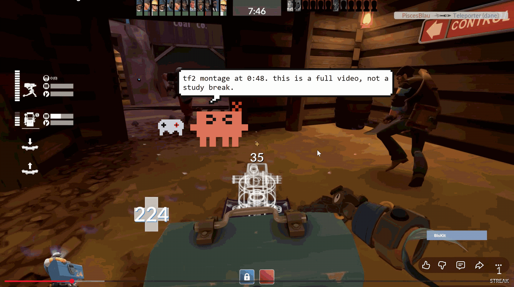
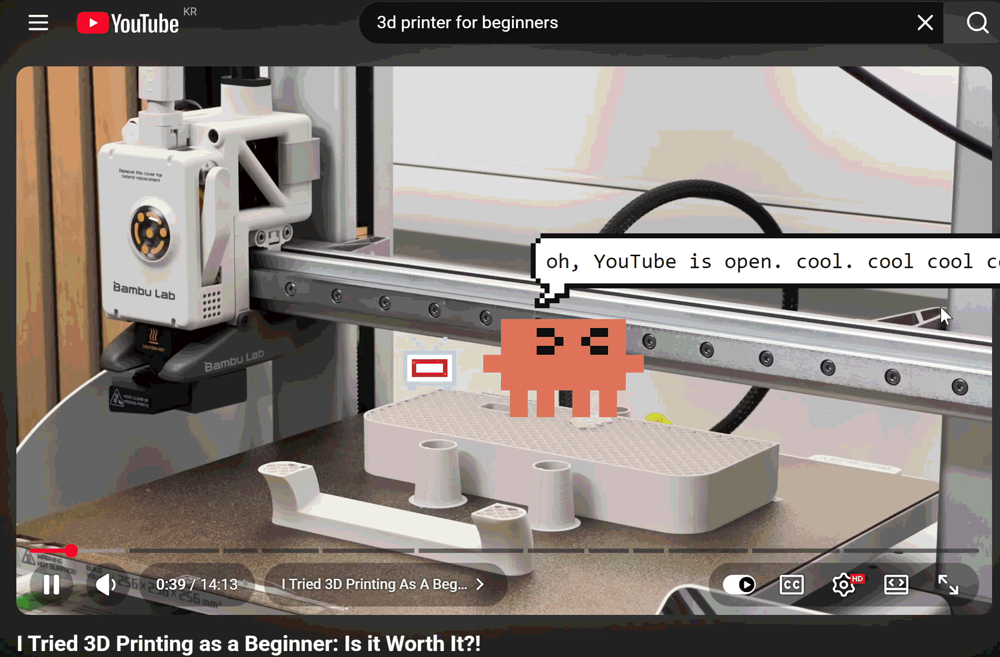
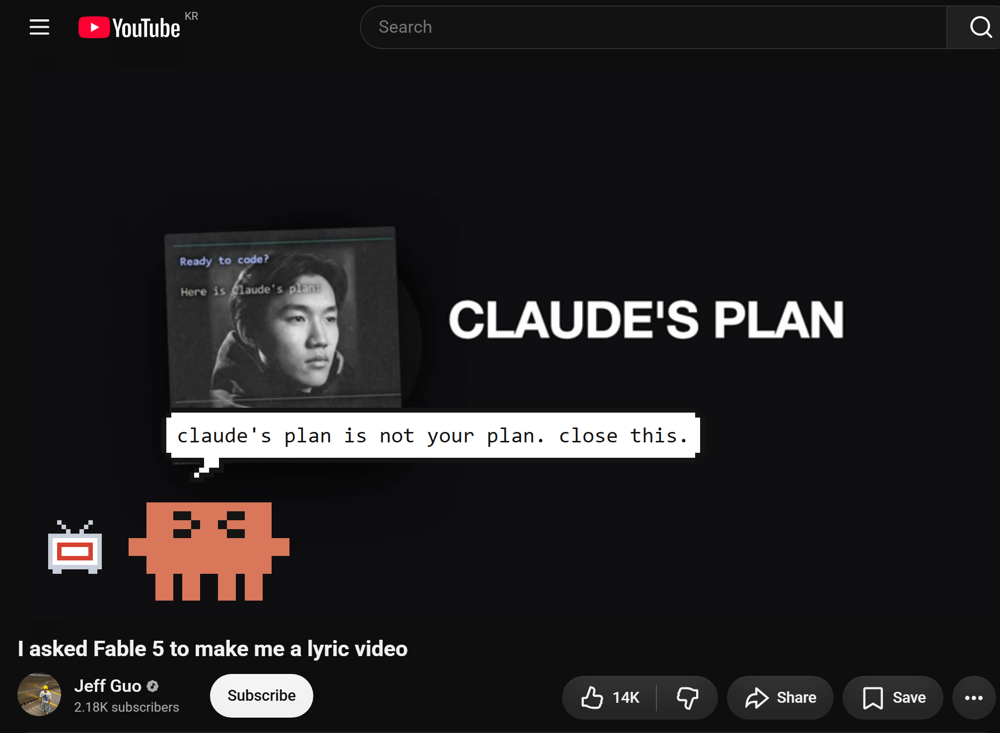

# Clawd

**A pixel study companion who reads what is actually on your screen — and says something only someone who saw it could say.**

Clawd sits in the corner of your desktop, notices which window is in front of you, and reacts to the *content* of it. He praises the specific thing you just got through, calls out the specific thing you wandered off to, and can quiz you on the page you are looking at right now without you ever leaving it.



> ### 🚧 In development

>
> This is a working prototype, not a finished product. It runs, but there are
> rough edges and known bugs — see [Status](#status). Built in the open as a
> personal project by an undergraduate EE student; issues and ideas welcome.

<!-- TODO: screenshot / GIF here — see docs/ -->

---

## Why this exists

Most study tools are schedulers wearing a costume. A Pomodoro timer counts down. A habit tracker counts days. A focus blocker counts minutes off-task. When they speak, they speak from a fixed list:

> *"Great job! Keep it up!"*
> *"You've been distracted for 12 minutes."*

Both sentences would be identical whether you had just finished a proof or spent the hour on a cat video. That is the whole problem — the app cannot know, so it cannot mean it, and you learn to ignore it within a day. A reward you can get by doing nothing stops being a reward.

Clawd is an attempt at the opposite: a companion whose reactions are only possible *because* he looked.

## What makes it different

### 1. Context, not a countdown

Clawd reads the screen, not the clock. What comes back is specific:

| A scheduler says | Clawd says |
| --- | --- |
| "Great job! Keep it up!" | "40 minutes on Laplace transforms without flinching. the partial fractions bit is the annoying part and you just did four of them." |
| "You've been distracted for 12 minutes." | "you closed the problem set on step 3. it's been twelve minutes of shorts. step 3 is still there." |

The design aim is three specific feelings, in the order they actually land:

- **Conscience (양심)** — the difference between being *counted* and being *seen*. A nag that names the thing you abandoned, and where you abandoned it, is hard to dismiss the way a notification badge is.
- **Achievement (성취감)** — praise that describes the actual material is evidence you did something. Praise that fits any session at all is evidence of nothing.
- **Camaraderie (동지애)** — he is a character with moods who is *present* during the work, not a dashboard you review after it. He gets visibly more disappointed the longer you stay away, and visibly pleased when you come back.

There is no score, no streak counter to protect, no gamified currency — those measure compliance with the app. Clawd only ever reacts to the work.

### 2. A quiz on this page, right now, without leaving it

Checking whether you actually absorbed something normally costs more attention than the checking is worth:

> open Claude → screenshot the page → crop it → attach it → type "quiz me on this" → read → switch back → find your place again

By the end of that you have left your study session, and you will probably not do it a second time.

In Clawd it is one click on the sprite in your peripheral vision. He captures the foreground window, asks **one short-answer question about the material actually on screen**, you type the answer into the speech bubble, and he grades it with an explanation. The whole loop happens in the corner of the screen, in the same posture you were already in.

### 3. He learns to shut up

The first version spoke every five minutes, forever. Two of those and you have learned the rhythm; an hour on one window is twelve interruptions, which is not company, it is a dripping tap.

What replaces it, in order of how much it matters:

- **Jitter** — every gap is multiplied by a random 0.7–1.3, so the rhythm is never learnable.
- **Decay** — each line on the same window pushes the next one out: 5 → 8 → 13 → 20 → 30 minutes, and no further. He introduces himself to a new window, then leaves you alone in it.
- **Memory of where you have been** — alt-tabbing away and back does not reset the counter. A window you left less than ten minutes ago comes back with its count intact.
- **Two hard mutes** — he does not speak into a full-screen window, and he does not speak while you are mid-keystroke.

Clicking him earns back exactly one step of the decay, not a reset.

---

## Features

**Reads the window**

- Every poll he reads the foreground window's **title and process name**. On Windows the title already contains the browser tab, so `"skibidi toilet compilation - YouTube - Chrome"` is fully legible without any screenshot.
- Classified as **study / stray / neutral / idle** against keyword and process lists — `ltspice.exe`, `matlab.exe`, `kicad.exe`, `code.exe`, `comsol.exe` and the EE vocabulary are all in the study list, and anything unrecognised is **neutral, not stray**. He does not shout at you for opening something he has not heard of.
- Lecture rescue: `"Electromagnetics Lecture 3 - YouTube"` is studying, not straying.
- Optional **allowlist mode** (`focus.allowlist_mode`, off by default) flips this to the strict version — a short list counts as studying and everything else is straying, your bank site included.
- `extra_study_keywords` / `extra_stray_keywords` in `config.json` override everything.

**Reads the screen**

- Screenshots go to the Claude API so the comment can be about the material rather than the app name. What triggers a capture and how to turn it off is in [Privacy](#privacy) — **it is not click-only by default**.
- Captures are JPEG, resized to 880px wide at quality 60, held in memory and never written to disk.
- He hides himself before capturing so he does not end up in his own screenshots.

**Reacts**

- A four-step escalation ladder the longer you stay off-task — grace (2 min) → annoyed (5) → disappointed (12) → concerned (25).
- Focus-streak praise, break reminders, late-night remarks, random tidbits when nothing is happening.
- Deadline and timetable awareness from a `schedule.json` you fill in yourself; right-click → *today's briefing*.
- A full offline line bank in both languages, so he has a personality with no API key and no network at all.

**Quizzes**

- One-click short-answer quiz on the current window, asked and answered in the speech bubble.
- Answers are graded with an explanation, not marked right/wrong.
- Falls back to a built-in EE question bank when offline.

**The character**

- Hand-drawn pixel sprite on an 18×11 cell grid — whole pixels only, no anti-aliasing, no tweening.
- A four-beat walk cycle, squash-and-stretch, directional facing, a distinct idle loop per mood.
- Walks, patrols, steps out of your way, and squirms when you pick him up.
- Fireworks after 10 minutes without mouse movement, to get you back.

**Living on the desktop**

- Transparent, always-on-top window; drag him anywhere.
- System-tray icon with the main menu, so he is reachable even when hidden.
- Three sizes (double-click to cycle), 한국어 / English for both the interface and his entire vocabulary.

**Costs**

- Two models: `claude-haiku-4-5` for chatter, comments, tidbits and sprite generation; `claude-sonnet-5` for quiz questions and grading.
- Per-call cost metering with daily and monthly caps — `$0.30` / `$5.00` by default. Past the cap he falls back to the offline bank rather than spending.
- Every call and its cost is written to `clawd.log`. In day-to-day use here it has come to roughly ten cents a month.

## How it works

```
foreground window ──► classify ──► state machine ──► chatter gate ──► what to say
  (title, process)    (study/       (escalation      (jitter,       │
                       stray/        ladder,          decay,        ├─► offline line bank  (free, instant)
                       neutral/      streaks)         mutes)        │
                       idle)                                        └─► Claude API  (optional)
                                                                           ▲
                                                       screenshot ─────────┘
```

Tkinter + ctypes for the window and the tray, `urllib` for the API. No framework, no game engine, no packaging step. API calls run on a worker thread and come back through a queue the Tk loop drains, so the animation never stutters.

## Privacy

Read this part before you run it.

**The window title never leaves your machine.** Classification is pure local string matching. With the API off, Clawd sends nothing anywhere, ever.

**Screenshots are a separate matter, and the shipped config does not make them click-only.** Two settings govern it:

| setting | default | effect |
| --- | --- | --- |
| `api.send_screenshots` | `true` | master switch. `false` = no capture ever, including when you ask |
| `api.screenshot_stray` | `true` | allows capture while you are off-task |

With the defaults, a capture happens in five situations — one of which is you:

1. you click *look at my screen* / double-click him
2. a study streak passes about three minutes
3. the off-task ladder steps up a tier
4. the periodic off-task recheck (every ~3 min while straying)
5. a quiz starts

Setting `api.screenshot_stray: false` removes 3 and 4. **There is currently no single setting that gives you 1 and nothing else** — 2 and 5 are not gated by it. If you want zero automatic capture today, set `api.send_screenshots: false` and accept that the manual look goes with it. Fixing this is the top item in [Status](#status).

Everything else:

- **Nothing is stored remotely.** State, spend and cache are plain JSON next to the script.
- **The log can be made blind.** `privacy.log_screen_details: false` (the default) keeps window titles and page topics out of `clawd.log`.
- **Window titles are hashed, not kept.** The chatter scheduler needs to know only whether this is the same window as last time, so it stores a hash — the list of what you had open cannot be read back out of it.
- **The API key never touches the repo.** Paste it into Clawd and it goes to `%LOCALAPPDATA%\Clawd\api_key`, outside the project folder, or supply `ANTHROPIC_API_KEY` in the environment. `config.json` ships with an empty `api_key` field and `.gitignore` warns you before you fill it in.

## Install

Windows only. Python 3.9+ (developed on 3.13).

```bat
git clone https://github.com/<you>/clawd.git
cd clawd
pip install -r requirements.txt   :: mss + Pillow — only needed for screenshots
run_clawd.bat                     :: or: pythonw clawd.pyw
```

He appears bottom-right. **Drag** him anywhere, **left-click** for a status check, **right-click** for the menu, **double-click** to change size.

The API key is optional. Without one he runs entirely offline on the built-in line bank; with one he can read the screen, write real quizzes and grade your answers. Right-click → *set api key…*

Your timetable goes in `schedule.json` — copy the blocks you want out of `schedule.example.json`. It is gitignored, so it stays on your machine.

Full option-by-option documentation is in **[docs/MANUAL.md](docs/MANUAL.md)**.

## Status

Working, and rough. Honest state of things:

**Works**

- Window watching, classification, the escalation ladder
- The chatter scheduler — jitter, decay, window memory, mutes
- The offline personality, both languages
- Sprite, animation, dragging, sizes, the speech bubble, tray menu
- Screenshot reading and screen-aware comments
- Cost metering and budget caps

**Known issues**

- **No click-only capture mode.** See [Privacy](#privacy) — the two screenshot switches do not compose into "only when I ask", which is what the shipped defaults ought to mean. Next thing to fix.
- Occasional failures in the tray-icon and menu layer.
- Quiz generation has been unreliable; error handling around malformed API replies is still being hardened.
- The held-item icon generator is on by default but drops stale results.
- Windows only — the window and tray code is Win32-specific.

**Next**

- A real capture policy: one switch, three honest positions (never / only when I ask / let him look)
- A small local vision model for the free tier of classification, so automatic looking costs nothing and the screen never leaves the machine
- Longer-horizon memory of what you have actually studied, so praise can reference last week
- A quieter mode for people who do not want a character talking to them

Run the test suite:

```bat
python tests\test_logic.py
python tests\test_chatter.py
:: ...one file per area, each printing ok / FAIL lines
```

## Project layout

```
clawd.pyw          launcher
core/
  app.py           the state machine — polls, decides, drives the UI
  watcher.py       what window is in front
  screenwatch.py   change detection on the foreground window
  classify.py      study / stray / neutral / idle
  chatter.py       when he is allowed to speak, and which line
  brain.py         Claude API calls, offline line selection
  bank.py          the offline line bank, 한/영
  lang.py          한국어 / English switching
  sprite.py        pixel Clawd, drawn cell by cell
  ui.py            the transparent overlay, bubble and answer box
  motion.py        walking, patrolling, getting out of the way
  items.py         generated held items
  fireworks.py     the anti-idle display
  tray.py          notification-area icon
  scheduler.py     schedule.json, deadlines, briefings
  budget.py        per-call cost metering and caps
  secrets.py       api key storage outside the repo
  capture.py       screenshots, in memory only
  dpi.py           per-monitor DPI
  single.py        single-instance lock
config.json        every threshold, timing and toggle
schedule.json      your timetable and deadlines (gitignored)
docs/MANUAL.md     option-by-option documentation
tests/             one runnable file per area
```

## Built with

Python standard library (tkinter, ctypes, urllib) · the Claude API · `mss` + `Pillow` for screen capture

---
